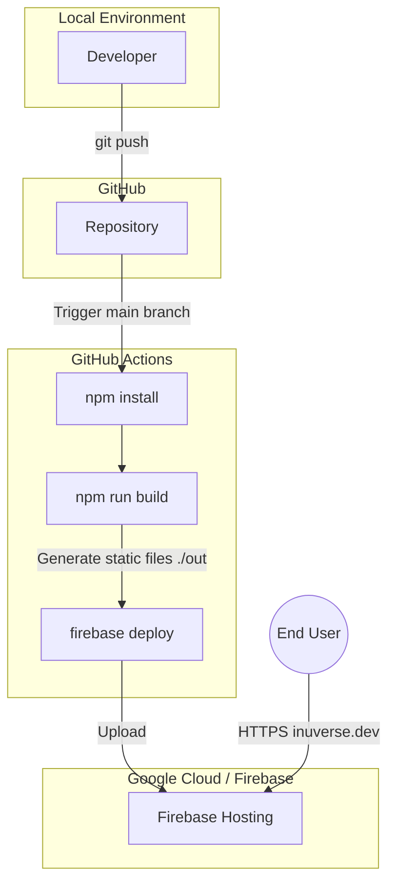

# Infrastructure Architecture

This document outlines the current infrastructure and deployment pipeline for the portfolio website.

## Deployment Pipeline

The system uses a completely static architecture hosted on Firebase Hosting, with deployments automated via GitHub Actions.

## Components

| Component | Tech Stack | Role |
|-----------|------------|------|
| **Frontend Framework** | Next.js 15+ (SSG) | Generates static HTML/CSS/JS at build time (`output: 'export'`). |
| **Hosting Provider** | Firebase Hosting | Serves the static assets globally via CDN. |
| **CI/CD** | GitHub Actions | Automates the build and deployment process on commits to `main`. |
| **DNS** | Google Cloud DNS | Manages the custom domain `inuverse.dev` records. |

## Network Flow

1.  **Development**: Code is written locally and pushed to GitHub.
2.  **Build**: GitHub Actions triggers on the `main` branch, installing dependencies and building the Next.js project.
3.  **Artifacts**: The build process produces a static `out/` directory containing all site assets.
4.  **Deployment**: The `firebase-tools` CLI uploads the `out/` directory to Firebase Hosting.
5.  **Access**: Users access `https://inuverse.dev`, which resolves to Firebase Hosting's edge nodes.
