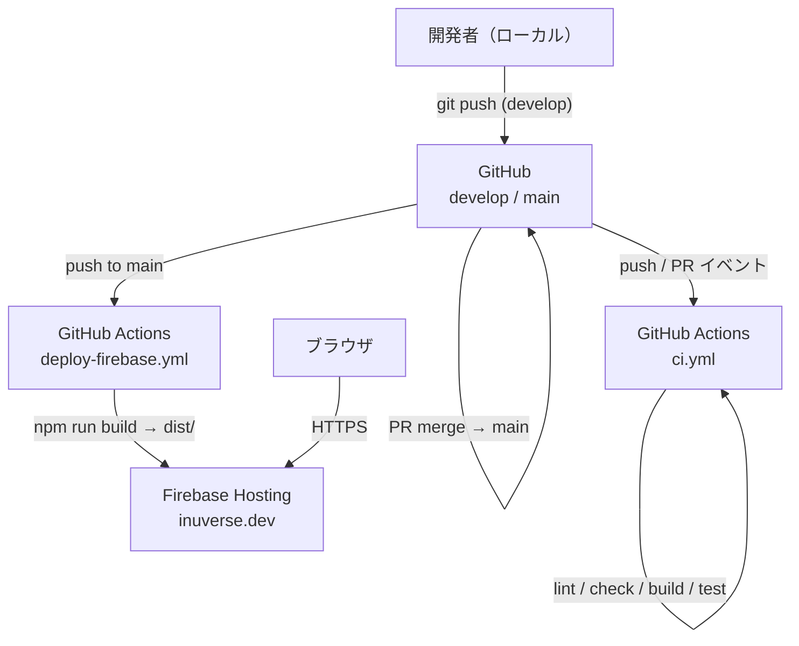
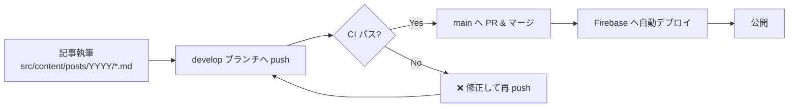
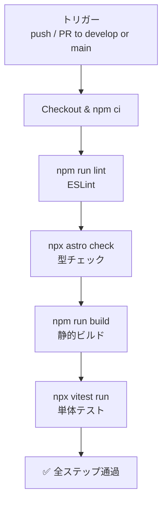
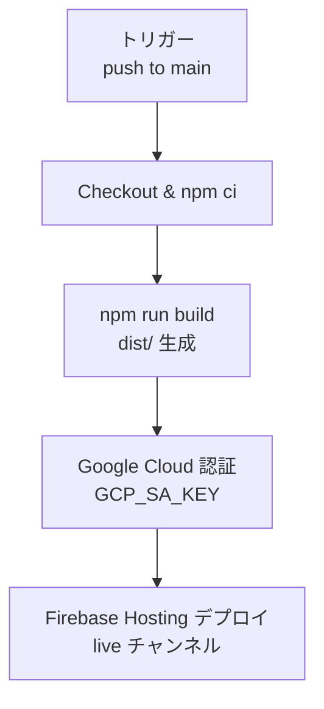

# 概要設計書

## 1. システム概要

Inuverse の個人ポートフォリオ兼技術ブログ。Markdown で記事を執筆し、静的 HTML としてビルドして Firebase Hosting へ自動デプロイする。

| 項目 | 内容 |
|------|------|
| URL | https://www.inuverse.dev |
| フレームワーク | Astro 5（静的サイト生成） |
| レンダリング | SSG（ビルド時に全ページを HTML 生成） |
| ホスティング | Firebase Hosting |
| CI/CD | GitHub Actions |
| リポジトリ | github.com/inuverse44/portfolio |

---

## 2. システム構成図

---

## 3. デプロイフロー

---

## 4. CI/CD パイプライン

### 4.1 ci.yml（develop・main への push および PR）

### 4.2 deploy-firebase.yml（main への push のみ）

### 4.3 必要な Secrets / Variables

| 名前 | 種別 | 用途 |
|------|------|------|
| `GCP_SA_KEY` | Secret | Firebase デプロイ用 GCP サービスアカウントキー |
| `FIREBASE_PROJECT_ID` | Variable | Firebase プロジェクト ID |
