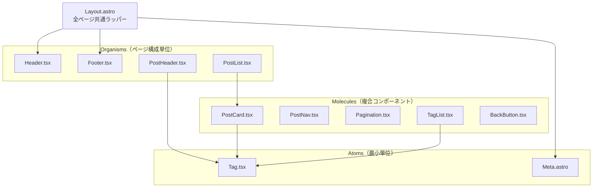
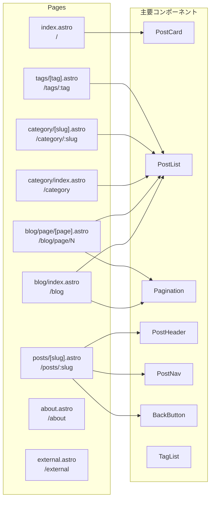
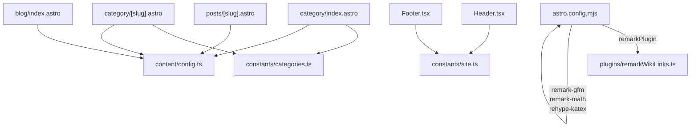

# アーキテクチャ設計書

## 1. ディレクトリ構成

```
portfolio/
├── src/
│   ├── content/
│   │   ├── config.ts              # コレクションスキーマ
│   │   └── posts/
│   │       ├── 2025/              # 年別ディレクトリ
│   │       └── 2026/
│   ├── pages/                     # ファイルシステムルーティング
│   ├── components/
│   │   ├── atoms/
│   │   ├── molecules/
│   │   └── organisms/
│   ├── layouts/
│   ├── plugins/                   # カスタム remark プラグイン
│   ├── constants/
│   ├── hooks/
│   ├── lib/                       # レガシー（未使用）
│   └── styles/
├── scripts/                       # 管理用スクリプト
├── public/                        # 静的アセット
├── docs/                          # ドキュメント
└── .github/workflows/             # CI/CD
```

---

## 2. コンポーネント構成

Atomic Design に基づく3層構成。



---

## 3. ページとコンポーネントの対応



---

## 4. モジュール依存関係



---

## 5. レンダリング戦略

| コンポーネント | 種別 | hydration | 理由 |
|--------------|------|-----------|------|
| `Layout.astro` | Astro | なし | 静的シェル |
| `Header.tsx` | React | なし（サーバーレンダリング） | インタラクション不要 |
| `Footer.tsx` | React | なし | インタラクション不要 |
| `PostCard.tsx` | React | なし | 静的カード |
| `PostHeader.tsx` | React | なし | 静的ヘッダー |
| `PostNav.tsx` | React | なし | 静的ナビ |
| `Pagination.tsx` | React | なし | 静的ナビ |
| `TagList.tsx` | React | なし | 静的リスト |

> `client:*` ディレクティブはインタラクティブな操作が必要なコンポーネントにのみ付与する。現状すべてサーバーレンダリングで完結している。
