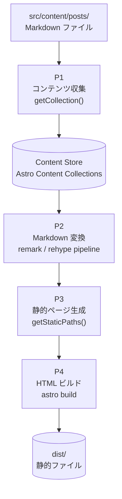
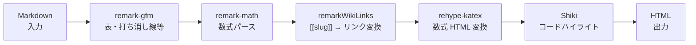
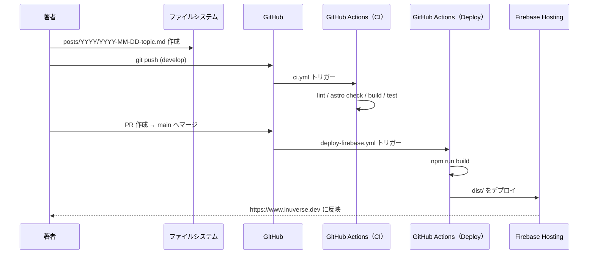
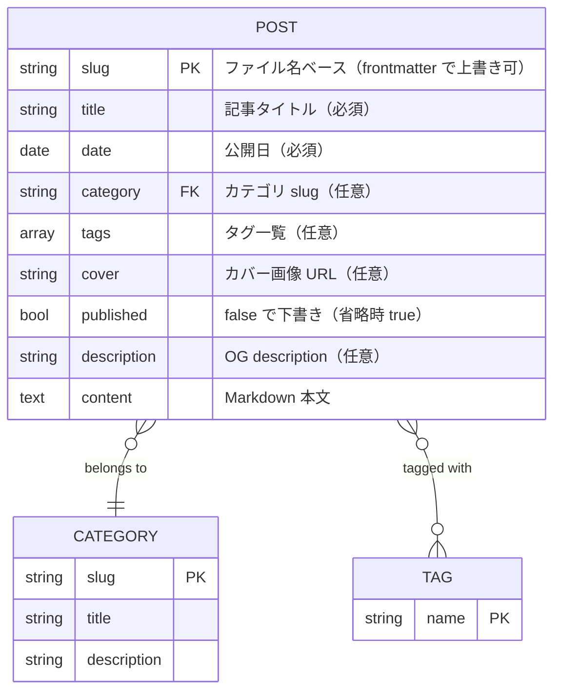

# データ設計書

## 1. データフロー図（DFD）

### レベル 0：コンテキスト図


---

### レベル 1：主要プロセス



---

### レベル 2：Markdown 変換パイプライン（P2 詳細）



---

### レベル 2：記事追加フロー（著者操作）



---

## 2. データモデル

### 2.1 Post（記事）



### 2.2 frontmatter サンプル

```yaml
---
slug: 2026-01-03-statistics-chapter2-prob   # サブディレクトリ移行時に明示
title: 統計学入門 第2章の問題について
date: '2026-01-03'
category: statistics-intro
tags:
  - 統計学
  - Kotlin
cover: https://example.com/image.jpg
published: true
description: 統計学入門の第2章を読んだメモです
---
```

---

## 3. ルーティングとスラッグの関係

| ファイルパス | slug | URL |
|------------|------|-----|
| `posts/2025/2025-11-14-rust.md` | `2025-11-14-rust`（frontmatter） | `/posts/2025-11-14-rust` |
| `posts/2026/2026-01-03-statistics-chapter2-prob.md` | `2026-01-03-statistics-chapter2-prob` | `/posts/2026-01-03-statistics-chapter2-prob` |

> Astro Content Collections はサブディレクトリを含めてスラッグを生成するが、frontmatter に `slug` フィールドを明示することで URL を上書きできる。年別移行スクリプト（`scripts/migrate-posts-to-year-dirs.mjs`）がこの挿入を自動処理する。

---

## 4. カテゴリ定義

カテゴリは `src/constants/categories.ts` に静的定義する。記事との紐付けは frontmatter の `category` フィールドで行う。

| slug | タイトル | 説明 |
|------|---------|------|
| `statistics-intro` | 統計学入門を読んでみた | 「統計学入門 東京大学出版会」の読書メモ |
