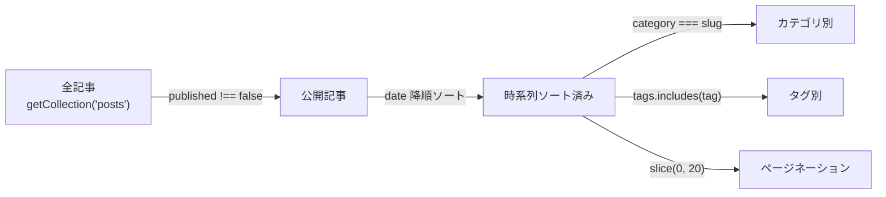

# 機能設計書

## 1. ページ一覧

| URL | ページ | 主な機能 |
|-----|--------|---------|
| `/` | トップ | 最新5件の記事リスト |
| `/blog` | ブログ一覧 | 全記事（20件/ページ）、ページネーション |
| `/blog/page/N` | ページネーション | N ページ目の記事一覧 |
| `/posts/:slug` | 記事詳細 | Markdown レンダリング、前後記事ナビ |
| `/category` | カテゴリ一覧 | カテゴリと記事数・プレビュー |
| `/category/:slug` | カテゴリ別記事 | カテゴリでフィルタした記事一覧 |
| `/tags/:tag` | タグ別記事 | タグでフィルタした記事一覧 |
| `/about` | 自己紹介 | プロフィール・経歴・出版物・資格 |
| `/external` | 外部リンク | SNS・参考サイト・アプリ集 |

---

## 2. Markdown 機能

| 機能 | 実装 | 備考 |
|------|------|------|
| GitHub Flavored Markdown | `remark-gfm` | 表・打ち消し線・タスクリスト等 |
| LaTeX 数式（インライン） | `remark-math` + `rehype-katex` | `$...$` |
| LaTeX 数式（ブロック） | 同上 | `$$...$$`、横スクロール対応 |
| コードシンタックスハイライト | Shiki（`one-dark-pro`） | ビルド時処理、JS 不要 |
| コードブロックのコピーボタン | `Layout.astro` インラインスクリプト | クリックでクリップボードにコピー |
| Kotlin インタラクティブ実行 | Kotlin Playground（CDN） | `.language-kotlin` ブロックに適用 |
| `[[slug]]` 内部リンク | `remarkWikiLinks.ts`（独自実装） | `/posts/slug` へ変換 |
| `[[slug\|テキスト]]` 内部リンク | 同上 | 表示テキストを指定可能 |

### [[...]] wiki-link 仕様

```
[[2025-11-14-rust]]
  → <a href="/posts/2025-11-14-rust">2025-11-14-rust</a>

[[2025-11-14-rust|Rust 入門の記事]]
  → <a href="/posts/2025-11-14-rust">Rust 入門の記事</a>
```

外部リンクは通常の Markdown 記法 `[text](url)` をそのまま使う。

---

## 3. 記事フィルタリング



---

## 4. スタイリング仕様

### 4.1 基本方針

- **CSS ファイル**: `src/styles/globals.css` のみ（CSS Modules・Tailwind 不使用）
- コンポーネント固有スタイル: `style={{}}` インライン属性
- レスポンシブ: `body` の `max-width` で自然に対応

### 4.2 デザイントークン

| トークン | 値 | 用途 |
|---------|-----|------|
| フォント | Roboto Mono | 全体（コード・本文共通） |
| リンク色 | `#7c3aed` | Obsidian パープル |
| 本文色 | `#1a1a1a` | メインテキスト |
| 補助色 | `#888` | 日付・メタ情報 |
| 背景 | `#ffffff` | ページ背景 |
| 罫線 | `#e5e5e5` | セクション区切り |
| コードブロック背景 | `#1e1e2e` | ダーク（Obsidian Catppuccin） |
| コードブロック前景 | `#cdd6f4` | 同上 |
| max-width | `740px` | コンテンツ幅 |

---

## 5. SEO / OGP

`src/components/atoms/Meta.astro` が各ページの `<head>` を生成する。

| メタ情報 | ソース |
|---------|--------|
| `<title>` | `Layout.astro` の `title` prop（省略時はサイト名） |
| `og:title` | 同上 |
| `og:description` | `description` prop |
| `og:image` | `image` prop（任意） |
| `og:type` | `type` prop（`website` / `article`） |
| canonical URL | `SITE_URL` + 現在パス |

---

## 6. テスト方針

E2E テストは廃止（個人ブログのため単体テストで十分と判断）。

| テスト種別 | ツール | 配置場所 | 実行コマンド |
|-----------|--------|---------|------------|
| 単体テスト | Vitest + Testing Library | `src/**/*.test.{ts,tsx}` | `npm run test` |

### 現行テスト

| ファイル | テスト対象 | 内容 |
|---------|-----------|------|
| `src/components/molecules/Pagination.test.tsx` | `Pagination.tsx` | ページネーションの表示・リンク生成・境界値 |

新しいロジックを持つコンポーネント・ユーティリティには、同階層に `.test.tsx` を追加する。
